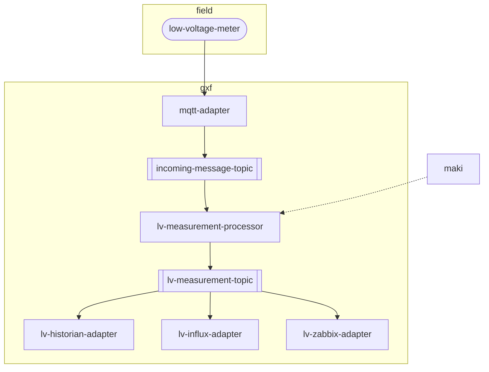

# Graphs

## Low Voltage system

```mermaid
flowchart TB
  subgraph gxf
    imt[[incoming-message-topic]]
    lvmt[[lv-measurement-topic]]
  
    mqtt-adapter-->imt;
  
    imt-->lv-measurement-processor;
    lv-measurement-processor-->lvmt;
    
    lvmt-->lv-historian-adapter;
    lvmt-->lv-influx-adapter;
    lvmt-->lv-zabbix-adapter;
  end

  subgraph field
    lvm([low-voltage-meter])
  end

  lvm-->mqtt-adapter;

  maki-.->lv-measurement-processor;
```
