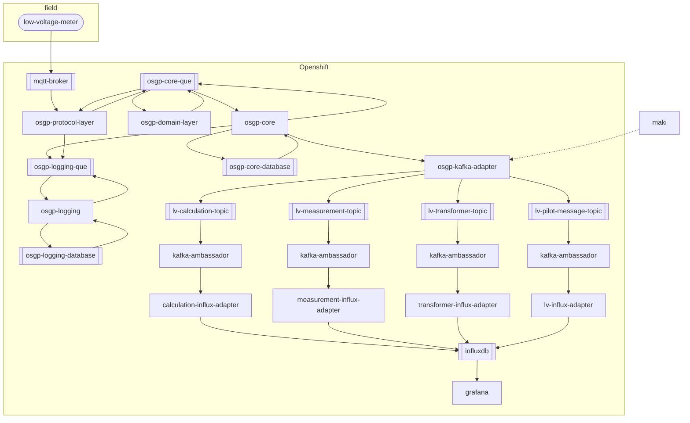
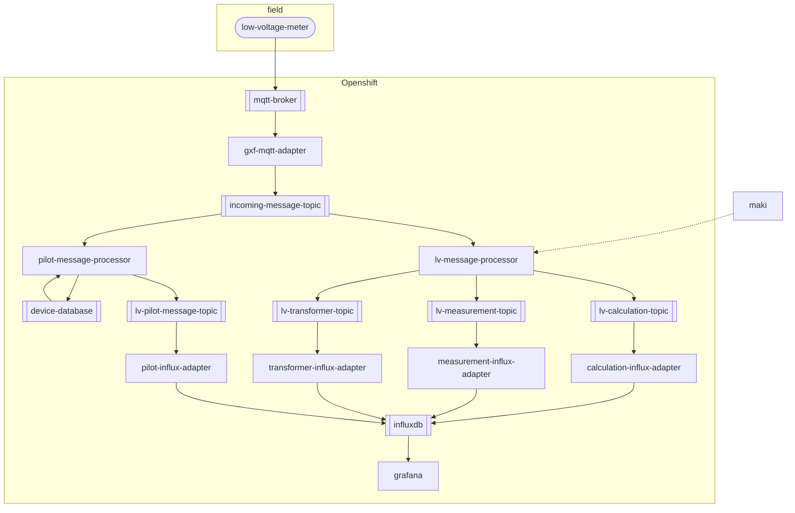

# Graphs

## Low Voltage system
### Current Design

```mermaid
flowchart TB
  subgraph Openshift
  
    olq[[osgp-logging-que]]
    old[[osgp-logging-database]]
    ocl[[osgp-core-que]]
    ocd[[osgp-core-database]]

    lvmt[[lv-measurement-topic]]
    mqtt-broker[[mqtt-broker]]
    
    %% core
    osgp-core-->olq
    osgp-core-->ocl-->osgp-core;
    osgp-core-->ocd-->osgp-core;
    osgp-core-->osgp-kafka-adapter;
    
    %% domain
    osgp-domain-layer-->ocl-->osgp-domain-layer
    
    %% Logging
    olq-->osgp-logging-->olq;
    old-->osgp-logging-->old;
    

    mqtt-broker-->osgp-protocol-layer-->ocl-->osgp-protocol-layer

    osgp-protocol-layer-->olq
    
   
    influxdb[[influxdb]]-->grafana
    osgp-kafka-adapter-->lvct[[lv-calculation-topic]]-->cka[kafka-ambassador]-->calculation-influx-adapter-->influxdb
    osgp-kafka-adapter-->lvmt[[lv-measurement-topic]]-->mka[kafka-ambassador]-->measurement-influx-adapter-->influxdb
    osgp-kafka-adapter-->lvtt[[lv-transformer-topic]]-->tka[kafka-ambassador]-->transformer-influx-adapter-->influxdb
    osgp-kafka-adapter-->pmt[[lv-pilot-message-topic]]-->lvka[kafka-ambassador]-->lv-influx-adapter-->influxdb

  end

  subgraph field
    lvm([low-voltage-meter])
  end

  lvm-->mqtt-broker

  maki-.->osgp-kafka-adapter

```

### New Design

```mermaid
flowchart TB
  subgraph Openshift
    imt[[incoming-message-topic]]
  
    mqtt-broker[[mqtt-broker]]
    mqtt-broker-->gxf-mqtt-adapter-->imt;

    imt-->lvmp[lv-message-processor];

    lvmp-->lvct[[lv-calculation-topic]]-->calculation-influx-adapter-->influxdb;
    lvmp-->lvmt[[lv-measurement-topic]]-->measurement-influx-adapter-->influxdb;
    lvmp-->lvtt[[lv-transformer-topic]]-->transformer-influx-adapter-->influxdb;

    imt-->pilot-message-processor-->pmt[[lv-pilot-message-topic]]-->pilot-influx-adapter-->influxdb;
 
    pilot-message-processor-->device-database[[device-database]]-->pilot-message-processor;
    influxdb[[influxdb]]-->grafana;
  end

  subgraph field
    lvm([low-voltage-meter])
  end

  lvm-->mqtt-broker;

  maki-.->lvmp;
  
```
